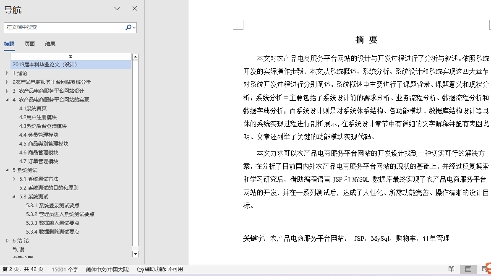
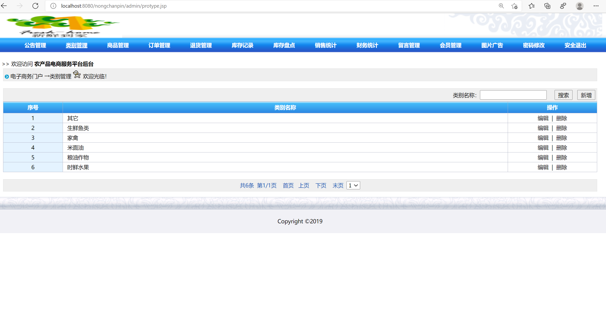
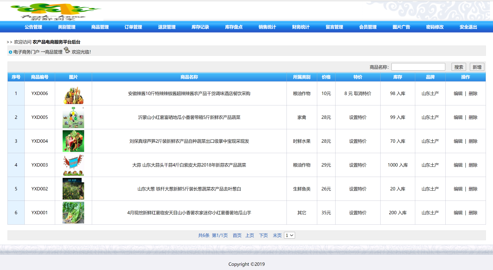
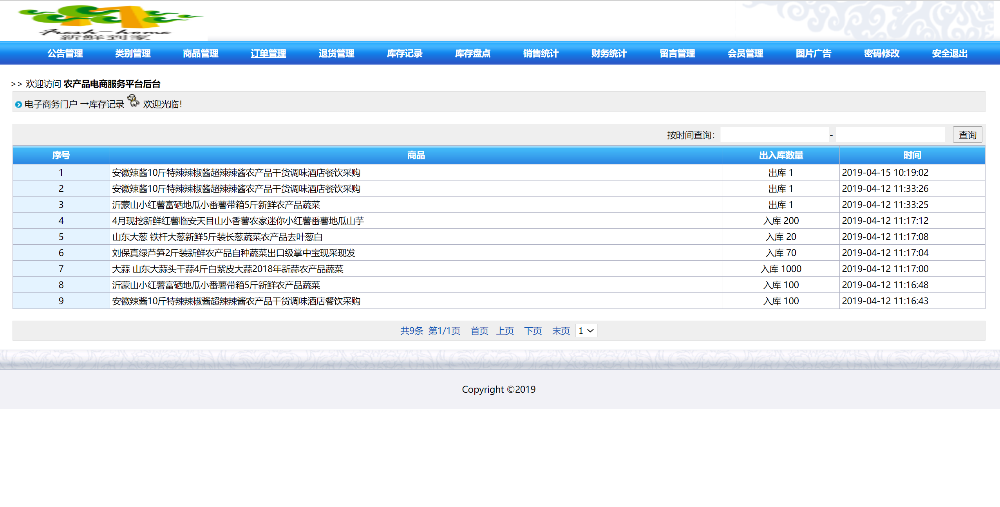
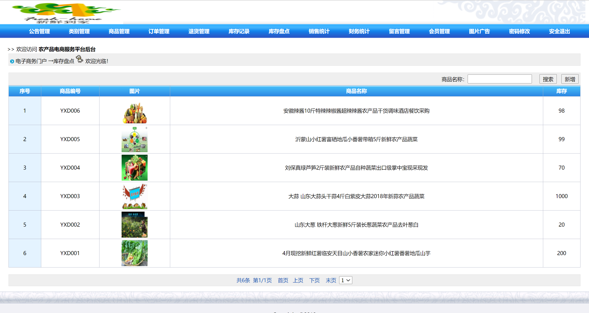
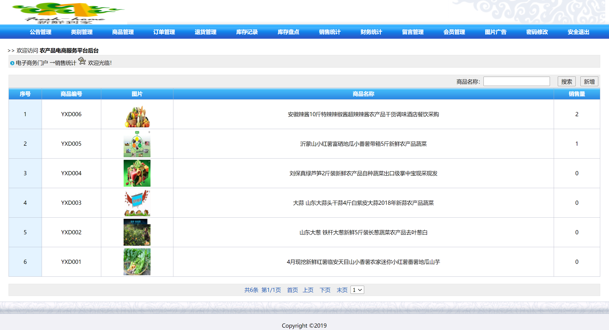

## 基于JSP+Servlet实现的农产品商城系统(程序+报告)

- <b>完整代码获取地址：从戎源码网 ([https://armycodes.com/](https://armycodes.com/))</b>
- <b>技术探讨、资料分享，请加QQ群：692619798</b> 
- <b>作者微信：19941326836  QQ：952045282</b> 
- <b>承接计算机毕业设计、Java毕业设计、Python毕业设计、深度学习、机器学习</b>
- <b>选题+开题报告+任务书+程序定制+安装调试+论文+答辩ppt 一条龙服务</b>
- <b>所有选题地址 ([https://github.com/YuLin-Coder/AllProjectCatalog](https://github.com/YuLin-Coder/AllProjectCatalog)) </b>

## 项目介绍
基于JSP+Servlet实现的农产品商城系统，主要功能如下

会员用户可以实现：注册登录、商品信息浏览、加入购物车、加入收藏、下单支付、查看公告、查看以及留言、个人信息管理
后台管理的实现：类别管理模块、商品管理模块、会员管理模块、订单管理、退货管理、库存记录、库存盘点、销售统计、财务统计、系统公告管理、留言板管理、修改密码模块

## 项目技术
- 编程语言：Java
- 数据库：MySQL
- 前端技术：JSP、JavaScript、bootstrap、JQuery
- 后端技术：struts、hibernate

## 运行环境
- JDK版本：JDK1.8及以上
- 开发工具：IDEA、Ecplise、Myecplise都可以
- 数据库: MySQL5.7及以上

## 运行截图

